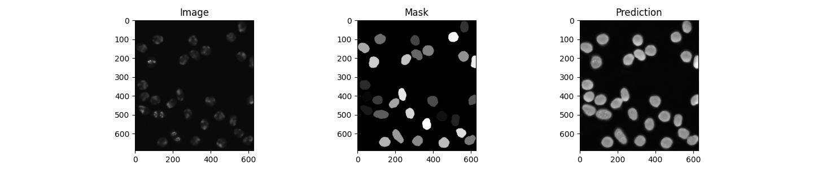

# Implementation of deep learning framework -- Unet, using PyTorch

The architecture was inspired by [U-Net: Convolutional Networks for Biomedical Image Segmentation](http://lmb.informatik.uni-freiburg.de/people/ronneber/u-net/).

## Overview

### Data

The original dataset is from [cell tracking challenge](http://celltrackingchallenge.net/2d-datasets/), and I've downloaded it and done the pre-processing.

### Model

This deep neural network is implemented with PyTorch functional API, which makes it extremely easy to experiment with different interesting architectures.

Output from the network is a 512*512 which represents mask that should be learned. Sigmoid activation function
makes sure that mask pixels are in \[0, 1\] range.

### Training

The model is trained for 10 epochs.

After 10 epochs, calculated accuracy is about 0.97.

Loss function for the training is basically just a binary crossentropy.

## How to use

### Dependencies

This tutorial depends on the following libraries:

* PyTorch

Also, this code should be compatible with Python versions 2.7-3.5.

### Run main.py

You will see the predicted results of test image in cell-tracking-using-unet/test_preds/

### Results

Use the trained model to do segmentation on test images, the result is statisfactory.

